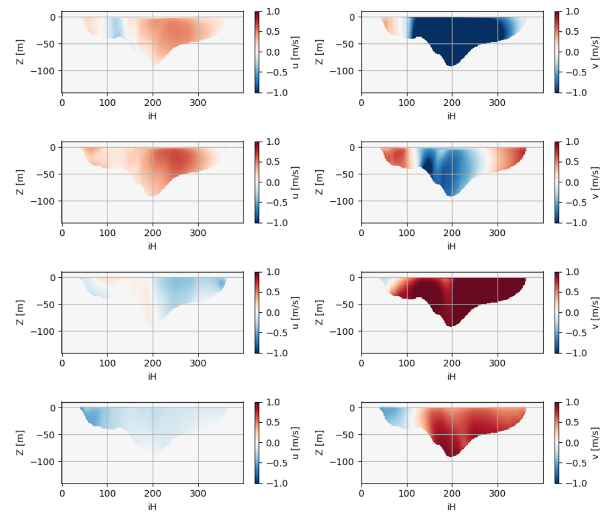
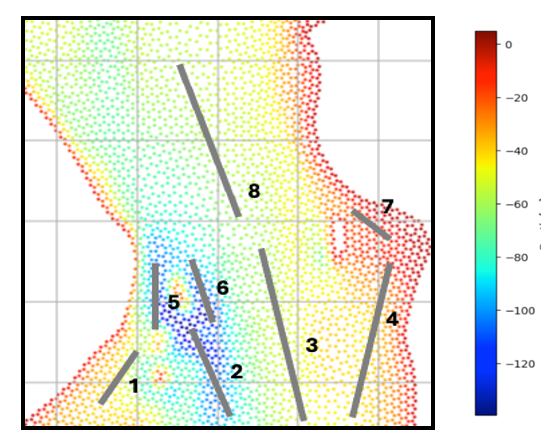
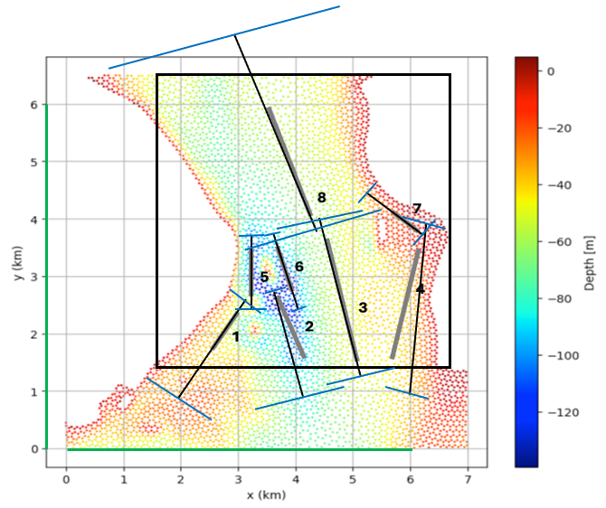

# Basic large test bed

## Setup and design choices

This is a test bed for a large section of the Rosario Strait. It is basic because it uses the channel builder for the bathymetry and velocity setup as opposed to FVCOM or field data. It is based on snapshots of FVCOM data, including the  and the , which were approximated using channel builder  (a two more segments were added to better approximate portions of the domain).

## Computational observations

With no additional refinements (using amr.max_level = 0), the projections converged easily without much parameter modification. Adding mesh refinements proved to be more difficult for the solver. Using field refinement alone to add cells at the terrain boundary, both amr.max_level = 1 and amr.max_level = 2 simulations could be brought to converge, but the nodal projection would stall out (use the maximum number of iterations) later on. Introducing a uniform mesh resolution across the interface fixed this, but this does increase the total number of cells.

These modifications helped the amr.max_level = 1 case run, but the amr.max_level = 2 case blew up immediately. Will continue to investigate.

## Flow observations

From the longest run performed, which shows the velocity at hub height (z = -17 m), the flow appears to develop well, but the free surface motion is significant and impactful at this depth, which is a concern. Because it is not in our interests to fully resolve the surface waves, we will need to add some functionality to handle this spurious phenomenon, which will likely be a type of relaxation zone for the free surface.