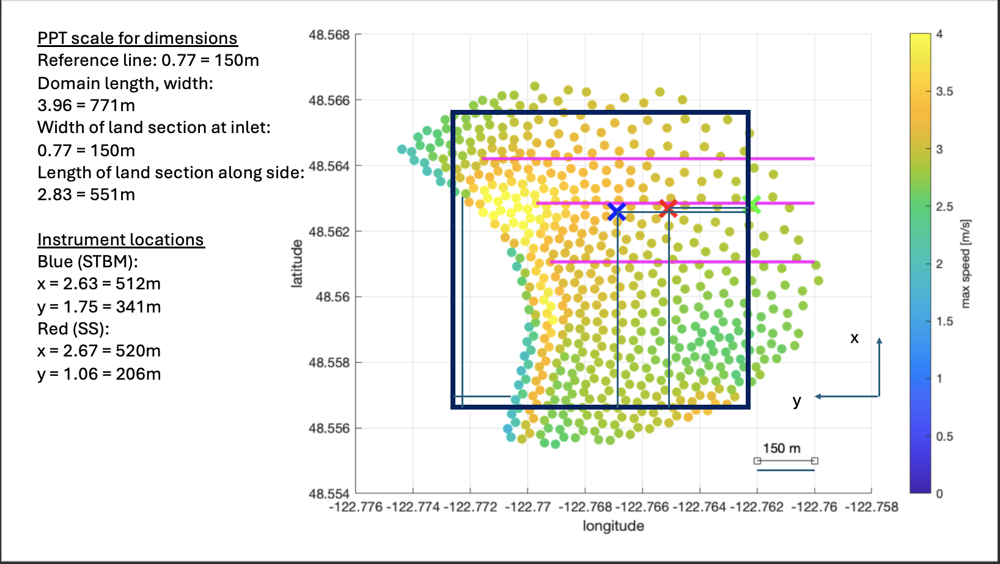
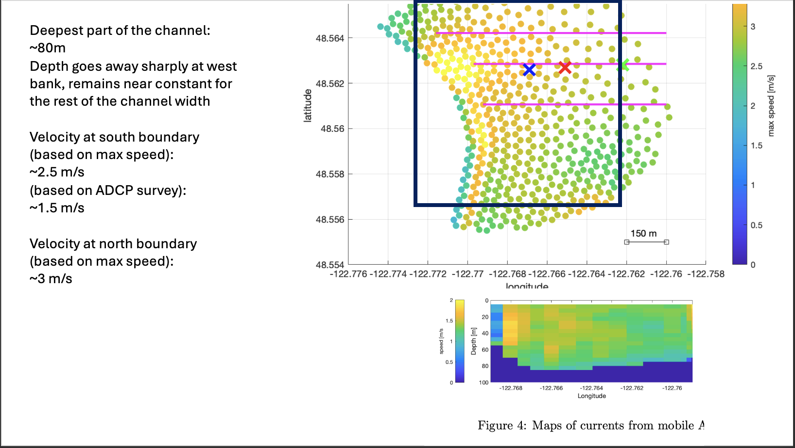
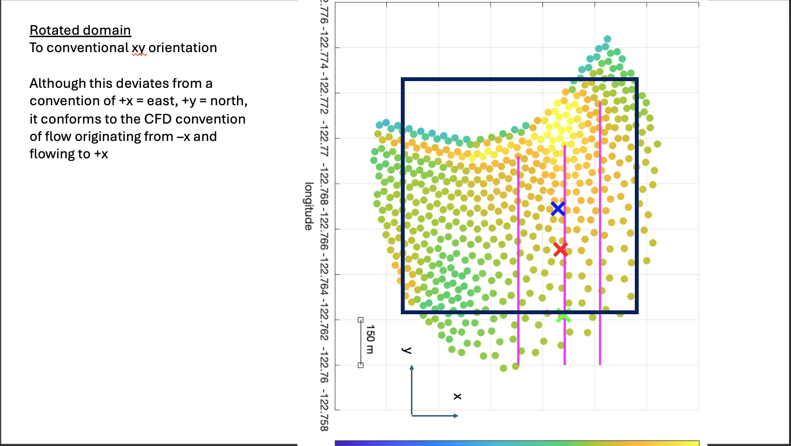

# Basic small test bed

## Setup and design choices

This is a test bed for a portion of the Rosario Strait that includes where the field measurements took place. It is basic because it uses the channel builder for the bathymetry and velocity setup as opposed to FVCOM or field data. It is small because it is very limited in geographical extent.

Though the eventual case will likely cover a bigger section of the strait, this case can still be useful for testing refinement zones, setting up post-processing pathways, and becoming familiar with simulations in this context.

This particular test bed was set up to mimic the section of the strait that is highlighted in the experimental campaign, shown in the image below. The channel builder parameters were chosen to approximate the dimensions of the channel here, and line samplers are included for the positions of the STBM and SS instruments. 

The initial and boundary velocities were chosen based on the approximate average flow speed measured in the mobile survey, as well as the depth of the channel.

Finally, the domain was rotated to match the typical CFD convention of flow from negative x to positive x.

## Computational observations

Without any modifications to the projection parameters, the MAC projection took around 100 iterations for every timestep. By modifying the number of pre and post smoothing iterations, the MAC took fewer iterations (around 10) and sped up.

Choosing a fixed timestep size is difficult because the flow takes a long time to develop. After running a few tests to choose the timestep of 0.35, the simulation eventually exceeded a CFL of 1 later on, after over 1000 steps. However, this did not lead to any stability issues in that particular run.

## Flow observations

The flow looks reasonable; see video of velocity field at hub height (17m below free surface). A recirculation region starts to form along the edge of the shore, and the fastest flow shows up just upstream of that region.

This case also illustrated some other less important aspects of the simulation that are helpful to be aware of. Though the simulation begins with a flat interface, and the inflow conditions feature a flat interface as well, the accelerations in flow create pressure perturbations which lead to perturbations in the interface location (surface waves). These reflect off the boundaries and the terrain, and there is no mechanism to dampen them. They are likely inconsequential, and they could potentially be diminished with finer mesh resolution.

Similarly, the motion of the water induces flow in the air. Because of the much higher momentum of the water pushing on the air, it is possible for the fastest velocities to be produced in the air. There is only a small buffer of air above the water, and the resulting flow patterns in the air are poorly resolved on this mesh, making them appear oscillatory. The motion of the surface waves appears correlated to the air velocities, despite the small amplitude of the waves.