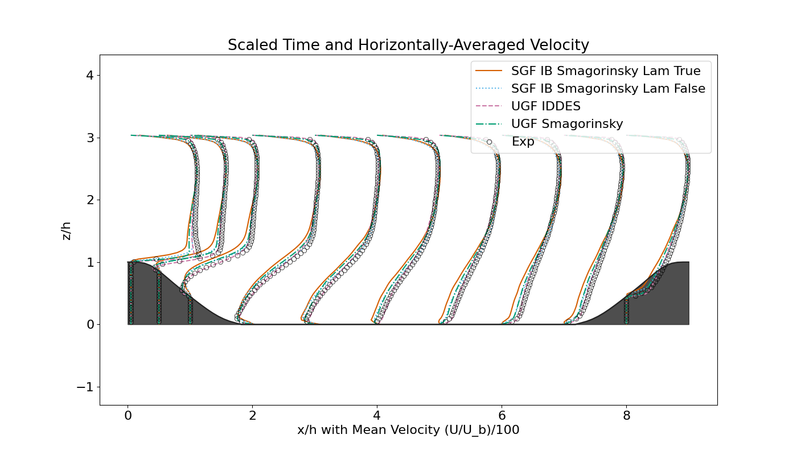
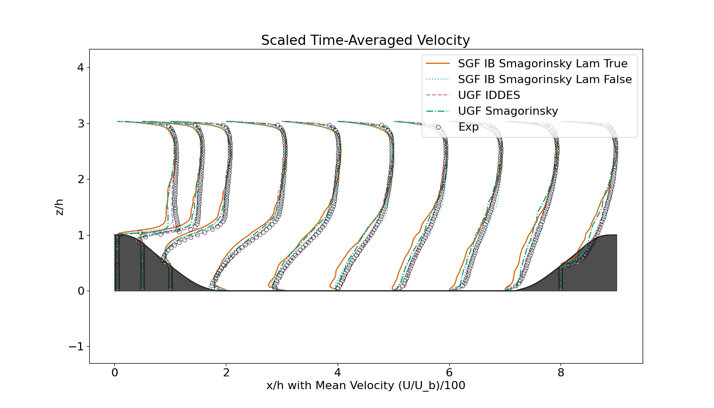
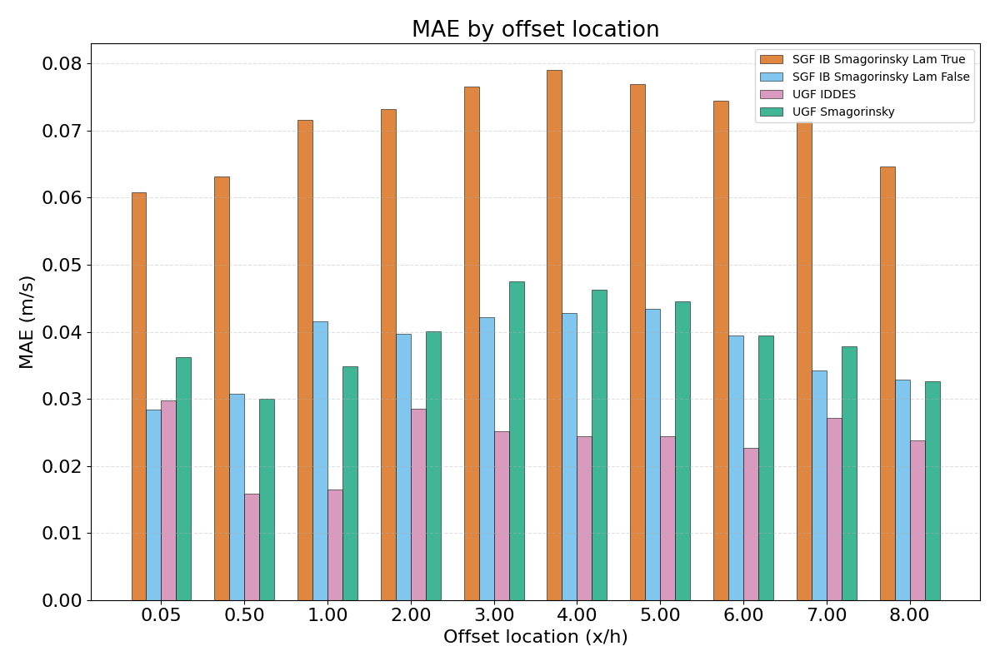
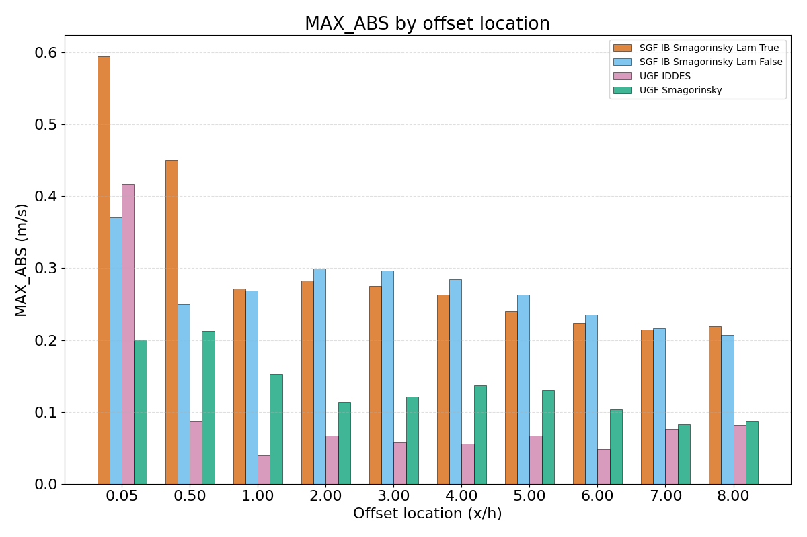

## UFR 3-30: Flow Over Periodic Hills 

This is an infinitely wide and long "periodic hill" test case, based on the geometry defined by Mellen et al. (2000). A row of 2D hills (height h=0.028m) sits in a channel with total height 3.036h, hill spacing (period) 9h, hill length 3.857h, defined by six polynomial segments. The flow separates at the hill crest, forms a recirculation zone in the lee of the hill, and reattaches naturally around x/h ≈ 4.5 before accelerating over the next hill. This is a canonical case for testing separation from a curved surface.

The case as implemented uses the following parameters:

| Parameter | Value |
| --- | --- |
| h | 0.028 m |
| $Re_{Hill}$ | 10595 |
| $dp/\rho dx$ | 0.067 |
| $U_{bulk}$ | 0.3785 m/s |
| $\rho$ | 1000.0 |

The Reynolds number comes from the hill height $h$ and the bulk velocity

$$
Re_{Hill} = \frac{U_{bulk} h}{\nu}
$$

The maximum (mean) target velocity in the experimental data in the upper channel (closest to the inlet) is related to the bulk velocity: 

$$
U_{max} = 1.0593 U_{bulk} = 0.4008 m/s
$$

In Kynema-UGF, a dynamic pressure gradient was employed to reach the target max velocity at the inlet. Though not exact, in Kynema-SGF, $dp/\rho dx$ was modified until an approximate $U_{bulk}$ and therefore $Re_h$ was achieved. The mean $dp/\rho dx$ from the UGF case was then applied back to the SGF case for parity. The final values for this are shown in the table below.

| Case | $dp/\rho dx$ |
| --- | --- |
| 2d_periodichill_ufr2_smag_last_islam0 | 0.059 |
| 2d_periodichill_ufr2_smag_last_islam1 | 0.059 |
| ugf_periodic_hill_final_cub1 | 0.0577 |
| ugf_periodic_hill_final_smag_cub1 | 0.0596 |

 

One flow-through time is approximately 0.6658 seconds. Results in the output file labeled with "h_mean" are averaged both on flow-through time and the channel span direction. Results in the output file labeled with "center_slice" are only averaged on flow-through time.

 

### Results

 

 

The plots above show inaccuracy in the vicinity of the leeward (left side of plot) side of the hill in the "Laminar" SGF-Immersed Boundary case. The UGF Smagorinsky case shows that some of this error is resultant from the turbulence model itself, and likely the lack of sufficient resolution near the wall (nor a wall model). 

 

 

Both the profiles and error plots show that the SGF Case with IB wall handling (Lam=False) has lower error than the Lam=True case, with the the MAE being approximately equal between UGF and SGF, and a max absolute error worse in the SGF case.

### Post-processing

The post-processing script takes a yaml files as input and is run as:

python periodichill_ufr.py -i periodichill_ufr2.yaml