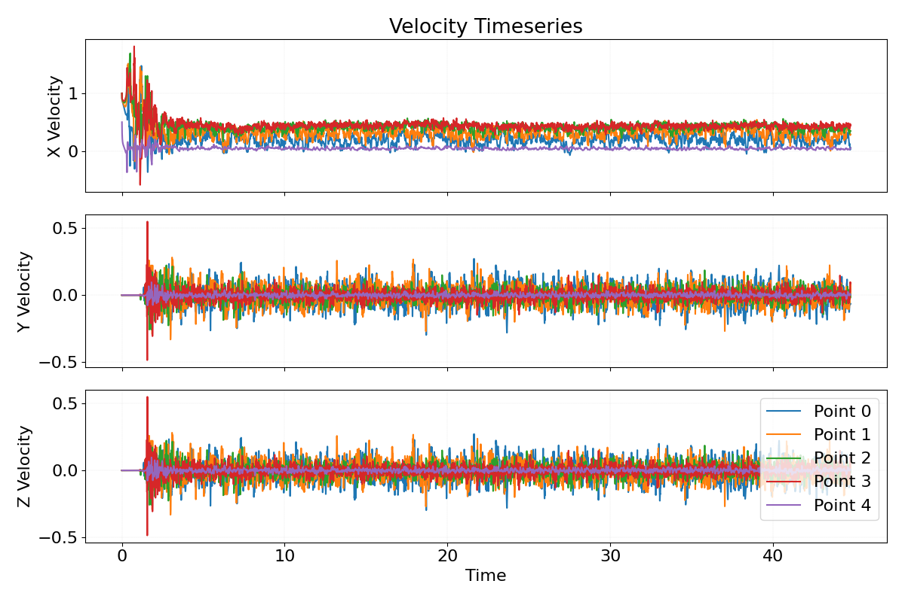

### UFR 3-30: Flow Over Periodic Hills 

This is an infinitely wide and long "periodic hill" test case, based on the geometry defined by Mellen et al. (2000). A row of 2D hills (height h=0.028m) sits in a channel with total height 3.036h, hill spacing (period) 9h, hill length 3.857h, defined by six polynomial segments. The flow separates at the hill crest, forms a recirculation zone in the lee of the hill, and reattaches naturally around x/h ≈ 4.5 before accelerating over the next hill. This is a canonical case for testing separation from a curved surface.

The case as implemented uses the following parameters:

| Parameter | Value |
| --- | --- |
| h | 0.028 m |
| $Re_{Hill}$ | 10595 |
| $dp/\rho dx$ | 0.067 |
| $U_{bulk}$ | 0.3785 m/s |
| $\rho$ | 1000.0 |

The Reynolds number comes from the hill height $h$ and the bulk velocity

$$
Re_{Hill} = \frac{U_{bulk} h}{\nu}
$$

The maximum target velocity in the experimental data in the upper channel is related to the bulk velocity: 

$$
U_{max} = 1.0593 U_{bulk} = 0.4008 m/s
$$

In Kynema-UGF, a dynamic pressure gradient was employed to reach the target max velocity at the inlet. Though not exact, in Kynema-SGF, $dp/\rho dx$ was modified until an approximate $U_{bulk}$ and therefore $Re_h$ was achieved. 

One flow-through time is approximately 0.6658 seconds. Results in the output file labeled with "h_mean" are averaged both on flow-through time and the channel span direction. Results in the output file labeled with "center_slice" are only averaged on flow-through time.

 

 

 

