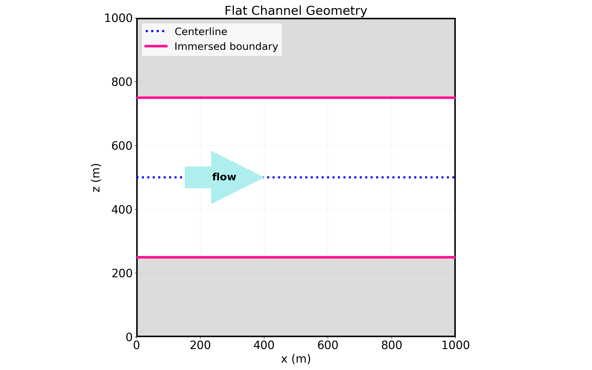
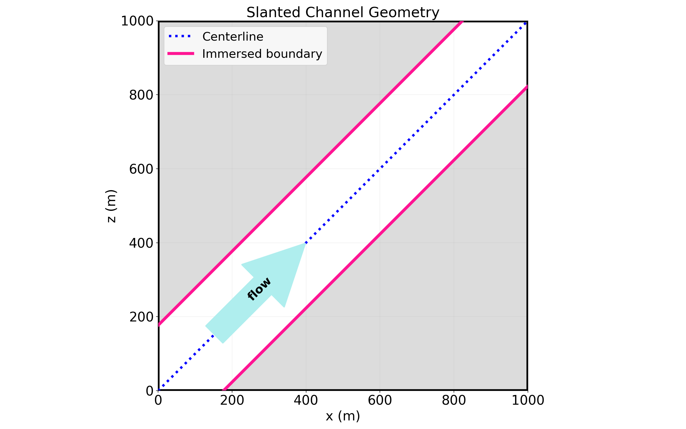
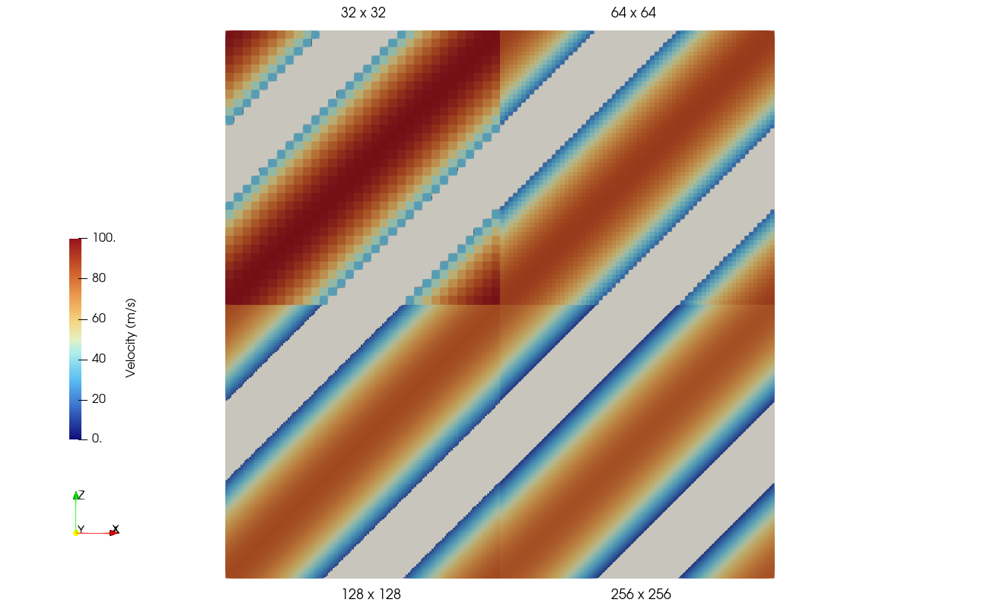
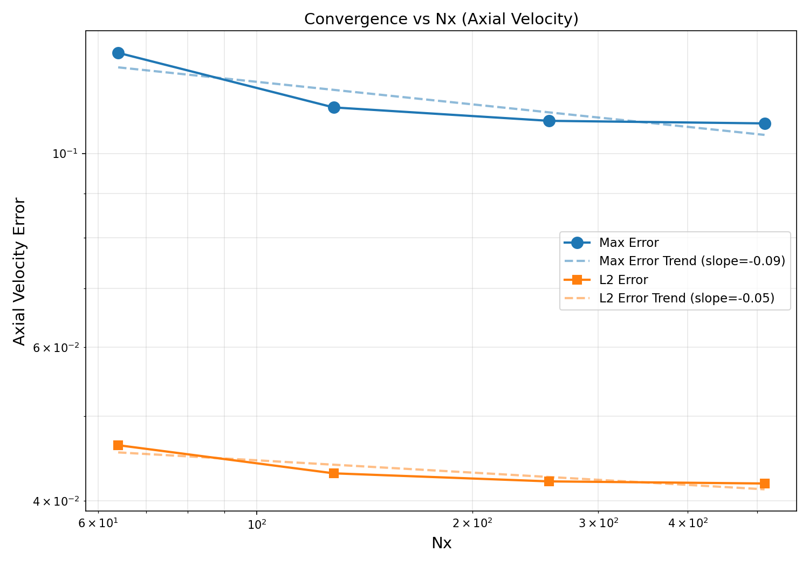
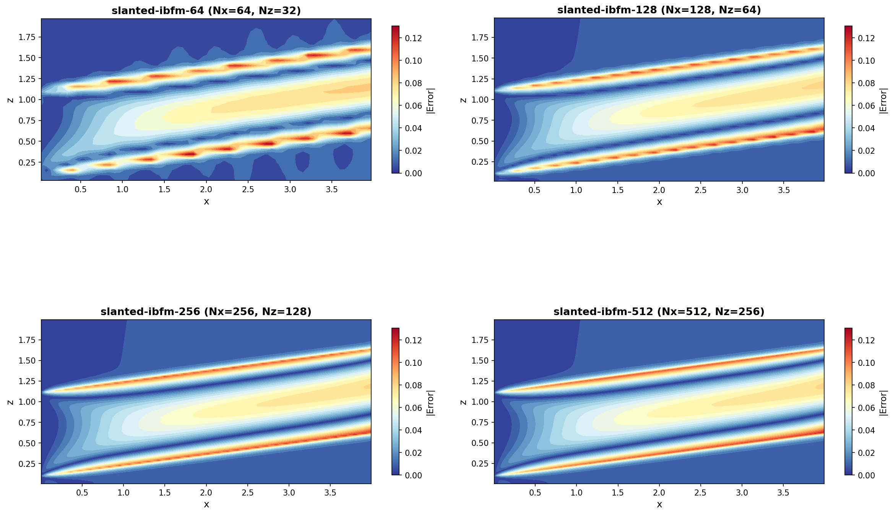
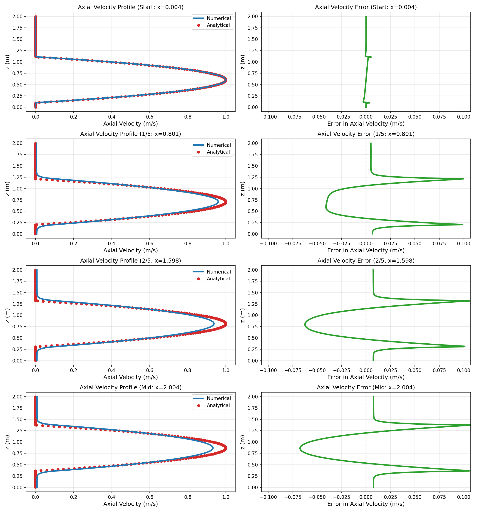

# Single Phase Laminar with IB

This case simulates laminar channel flow for a single phase with two channel configurations:

- A flat channel where the lower and upper walls are defined using IB 
- A slanted channel with $\theta = 45^\circ$, where $\theta$ is measured from the x-axis.

In both cases, the IB is defined using `ChannelBuilder` physics and the flow is pressure driven with periodic boundary conditions at the inlet and outlet. The pressure gradient is determined from the analytical solution, and enforced via a body forcing term $ \vec{F} = -\frac{1}{\rho} \nabla p $.

## Flat Channel Configuration
In the flat channel configuration, the channel is aligned with the cell faces. This is accomplished by setting the channel position based on the coarsest mesh $(N_x, N_y, N_z) = (32, 4, 32)$. This way each consecutive refinement remains aligned with the IB.  

## Slanted Channel Configuration
For the slanted channel case, periodicty is maintained by defining three channels with the following start and end points for the `ChannelBuilder` segments:

1. $(0, 0, 0) \rightarrow (L_x, 0, L_z)$
1. $(-L_x/2, 0, L_z/2) \rightarrow (L_x/2, 0, 3L_z/2)$
1. $(L_x/2, 0, -L_z/2) \rightarrow (3L_x/2, 0, L_z/2)$

Channel 1 is shown in the figure below.

## Input Files and Organization

There are two base input files for the flat and slanted cases, respectively:

- `base-flat-poiseuille.inp`
- `base-slanted-poiseuille.inp`

Individual case subdirectories and inputs for convergence studies are generated via the python script `python/generate_cases.py`. To see a full list of options run `python generate_cases.py -h`. Each generated subdirectory has a naming convention: `{flat|slanted}-drag-{og|temp}-{nx}` where `og` and `temp` refer to original and temporal drag limiters respectively, and `nx` is the grid resolution. 

Each subdirectory contains an input file with two lines:

~~~
FILE = ../base-<flat-or-slanted>-poiseuille.inp
amr.n_cell = Nx Ny Nz 
~~~

These directories store `plt` and `chk` files at different grid resolutions for error convergence analysis. The base input file `base-{flat|slanted}-poiseuille.inp` is shared by all cases and contains all channel geometry and physics parameters.

The cases are setup to test various drag forcing parameters:
~~~
DragForcing.use_original_drag_limiter
DragForcing.use_temporal_drag_limiter
~~~

Running `python generate_cases.py` with `--og` (original limiter) or `--temp` (temporal limiter, default) adjusts both the subdirectory naming and the corresponding input file settings.

## Pre and Post-Processing
Pre-processing uses `python/base_setup.py` to generate channel configurations based on mode (`--flat` or `--slanted`), resolution (`--nx`), and drag variant (`--og` or `--temp`). Use the "help" option to see all available parameters:
~~~
python python/case_setup.py -h
~~~

Post-processing is handled by `python/post_process.py`, which performs convergence analysis and generates visualization plots organized by drag variant (e.g., `figures/flat-drag-og/`, `figures/slanted-drag-temp/`). The script automatically parses all required parameters from the base input files:
~~~
python python/post_process.py --flat --temp
python python/post_process.py --slanted --og
~~~

## Analytical Solution

Provided a 2D domain in the x-z plane with periodic boundaries in $y$,the analytical solution for fully-developed channel flow is:

$$u(r) = U_{\max} \left(1 - \left(\frac{2r}{H}\right)^2\right)$$

where:
- $r$ = perpendicular distance from centerline
- $U_{\max}$ = maximum velocity (at centerline, $r=0$)
- $H$ = channel height
- $u(r) = 0$ for $r > H/2$ (at pipe wall)

Here, $r$ is measured in the x-z plane perpendicular to the tilted centerline as:

$$r = |x\sin\theta - (z-z_s)\cos\theta|.$$

The centerline is shifted vertically by $z_s$ in the z-direction, 

$$z_s = \frac{H}{2\cos\theta} + \sigma$$

and rotated at an angle $\theta$ about the point $(0, 0, \sigma)$ in x-z plane. Here, $\sigma$ is height in the z-direction where the bottom left corner of the channel intersects the domain boundary at $x = x_{lo}$.

The equation for the centerline is given by:

$$z = x\tan\theta + z_s.$$

The associated pressure gradient is:

$$ \nabla p = - \frac{8\mu U_{max}}{H^2}[ \cos\theta, \; 0, \; \sin\theta]. $$

From this, we can see that 

$$ U_{max} = - \nabla p \frac{H^2}{8\mu} .$$

Therefore, $U_{max}$ increases proportial to $H^2$. The IBFM implemented 

# Results

The following results are from running multiple cases with the following number of FVM cells in each spatial direction:

| Case | $N_x$ | $N_y$ | $N_z$ |
| ---- | ----- | ----- | ----- |
| 1    | 32    | 4     | 32    |
| 2    | 64    | 4     | 64    |
| 3    | 128   | 4     | 128   |
| 4    | 256   | 4     | 256   |

All error analysis is conducted by calculating global errors for all $(x,z)$ satisfying $r < 1.2 \times H/2$. This ensures no artifacts from the additional channels required for the slanted case are included in the error calculations. Errors are calculated using the $L_\infty$ and $L_2$ norms of the error across all grid resolutions. 

## Flat Channel

## Slanted Channel

The following figure shows the axial velocity, 

$$u_r (x,z) = u\cos\theta + w\sin\theta,$$

of the slanted channel simulations from the coarsest to finest grid:

### Error Convergence Analysis

The error is calculated globally for all $(x,z)$ satisfying $r < 1.2 \times H/2$. 

The plot below shows both the maximum ($L_\infty$) and $L_2$ norms of the error across all four grid resolutions for all $x < x_{mid}$:

### Error Field Visualization

The spatial distribution of axial velocity error across all four cases:

The colormaps show where the largest errors occur, with careful attention to near-wall regions where boundary conditions are imposed.

### Velocity Profile Comparison

Comparison of analytical and numerical axial velocity profiles at four streamwise locations (start, 1/5, 2/5, and midway) for the finest grid resolution:

Left column shows the velocity profiles with analytical solution (markers) overlaid on numerical solution (line). Right column shows the error growth along the domain.
