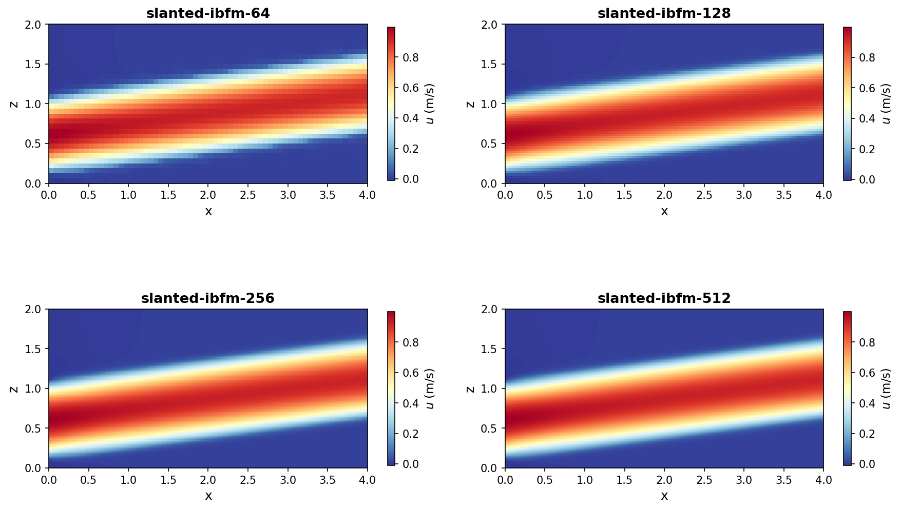
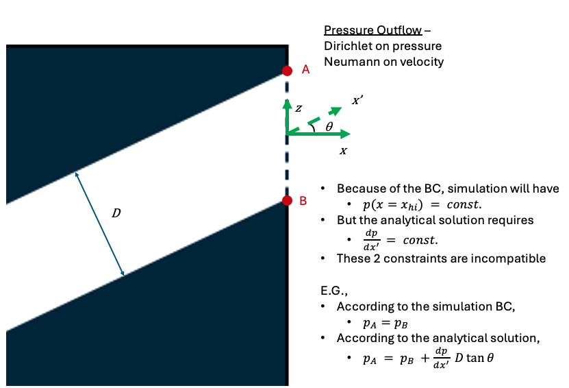
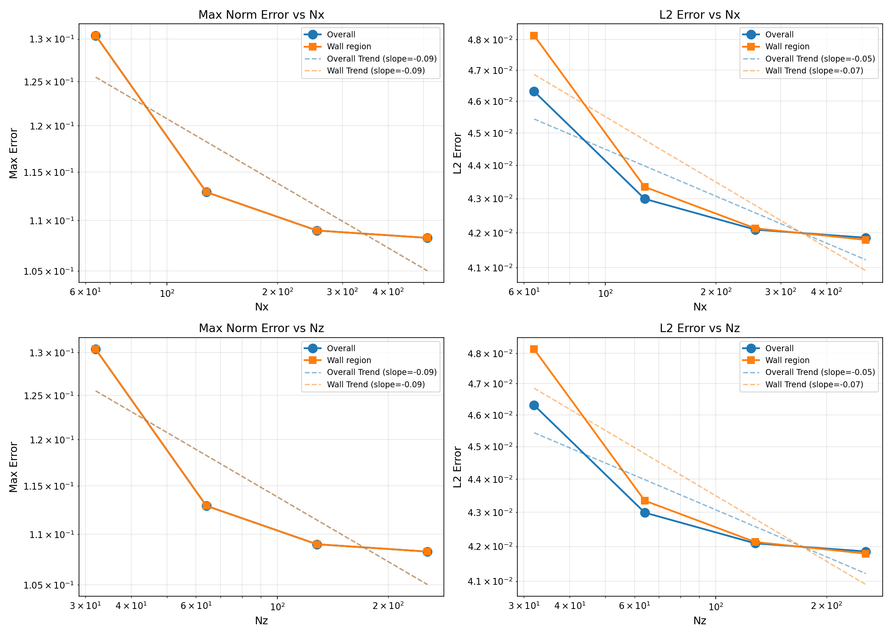

# Slanted Poiseuille Flow

This is a laminar channel flow in a single phase with a channel that has been slanted at an angle $\theta$ as measured in the $x$-direction.  The flow is represented as a half-channel using a symmetry plane.  The analytical solution for velocity is applied as Dirichlet inflow.  The outflow is Dirichlet on pressure, and a pressure gradient naturally forms.

## Input Files and Organization

Each subdirectory in the `cases` directory contains an input file with two lines:

~~~
FILE = ../base-slanted-poiseuille.inp
amr.n_cell = Nx Ny Nz 
~~~

These directories are for storing `plt` and `chk` files at different grid resolutions for error convergence analysis. The input file `base-slanted-poiseuille.inp` is shared by all cases and can be updated using values outputed from the pre-processing script `python/SlantedChannelConfig.py`.

## Pre and Post-Processing
There are two associated python pre- and post-processing scripts. These scripts require the following python packages:

~~~
numpy matplotlib yt
~~~ 

Pre-processing is handled by the `SlantedChannelConfig.py` script, which prints out input parameters for the simulation provided an angle $\theta$ in degrees or radians. Use the "help" option to see a full list of optional parameters and example usage:
~~~
python python/SlantedChannelConfig.py -h
~~~

Post processing is handled by running each cell of the `SlantedChannelPostProcess.ipynb` notebook. Note that this will only look for data in the `cases/slanted-ibfm-###` directories, and by default grabs the last `plt` file. 

## Analytical Solution

Provided a 2D domain in the x-z plane with periodic boundaries in $y$,the analytical solution for fully-developed parabolic (Poiseuille) channel flow in a tilted, vertically-shifted configuration is:

$$u(r) = U_{\max} \left(1 - \left(\frac{2r}{H}\right)^2\right)$$

where:
- $r$ = perpendicular distance from centerline
- $U_{\max}$ = maximum velocity (at centerline, $r=0$)
- $H$ = pipe diameter
- $u(r) = 0$ for $r > H/2$ (at pipe wall)

Here, $r$ is measured in the x-z plane perpendicular to the tilted centerline as:

$$r = |x\sin\theta - (z-z_s)\cos\theta|.$$

The centerline is shifted vertically by $z_s$ in the $z$-direction, 

$$z_s = \frac{H}{2\cos\theta} + \sigma$$

and rotated at an angle $\theta$ about the point $(0, 0, \sigma)$ in x-z plane. Here, $\sigma is height in the $z$-direction where the bottom left corner of the channel intersects the domain boundary at $x = x_lo$.

The equation for the centerline is given by:

$$z = x\tan\theta + z_s.$$

# Results

The following results are from running four cases with the following number of FVM cells in each spatial direction:

| Case | $N_x$ | $N_y$ | $N_z$ |
| ---- | ----- | ----- | ----- |
| 1    | 64    | 4     | 32    |
| 2    | 128   | 4     | 64    |
| 3    | 256   | 4     | 128   |
| 4    | 512   | 8     | 256   |

## Numerical Velocity Field

The following shows the axial velocity, 

$$u_r (x,z) = u\cos\theta + w\sin\theta,$$

of the numerical simulations from the coarsest to finest grid:

## Error Convergence Analysis

The error is calculated globally for all $x <= x_\text{mid}$ for each grid. The downstream domain is excluded from this analysis due to numerical errors arising from the Dirichlet pressure boundary condition at the outlet, which contradicts the analytical solution where pressure has no radial variation. See the figure below for more details:

The plot below shows both the maximum ($L_\infty$) and $L_2$ norms of the error across all four grid resolutions for all $x < x_{mid}$:

## Error Field Visualization

The spatial distribution of axial velocity error across all four cases:

The colormaps show where the largest errors occur, with careful attention to near-wall regions where boundary conditions are imposed.

## Wall Error Analysis

Detailed convergence analysis of errors in overall domain vs. near-wall regions (quarter-height from boundary) for both ($L_\infty$) and $L_2$ norms:

## Velocity Profile Comparison

Comparison of analytical and numerical axial velocity profiles at four streamwise locations (start, 1/5, 2/5, and midway) for the finest grid resolution:

Left column shows the velocity profiles with analytical solution (markers) overlaid on numerical solution (line). Right column shows the error growth along the domain.
