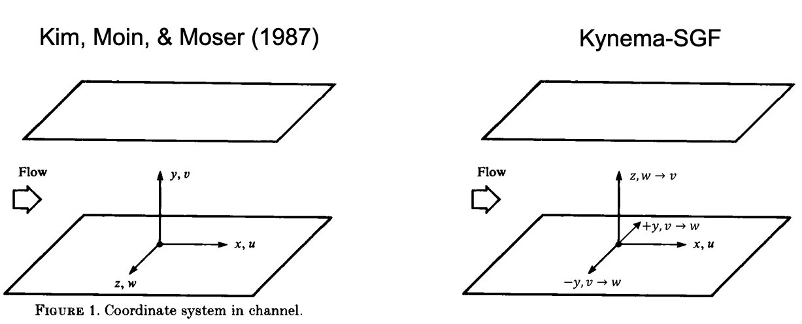
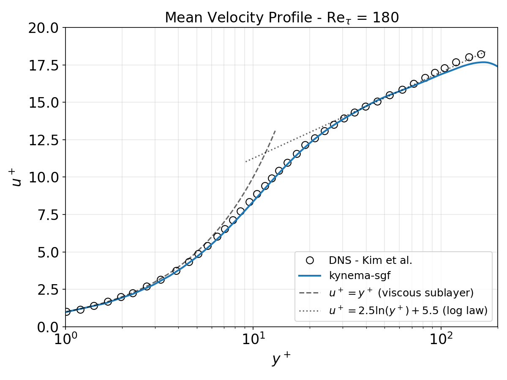
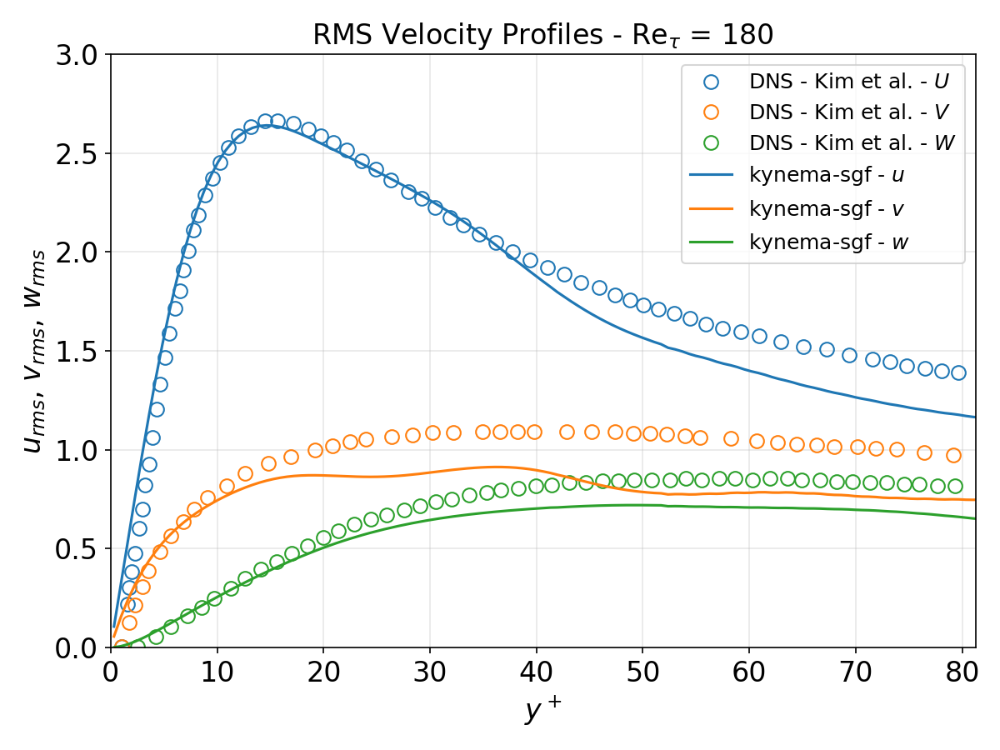

# Single Phase Turbulence in Flat Channel

This validation case simulates turbulent channel flow at three stress Reynold's numbers $\text{Re}_\tau = $ 180, 395, and 934 corresponding to the cases described in [Kim, Moin & Moser (1986)](https://doi.org/10.1017/S0022112087000892), [Moser, Kim & Mansour (1999)](https://doi.org/10.1063/1.869966), and [Hoyas & Jimenez (2006)](https://doi.org/10.1063/1.2162185), respectively. A first DNS is performed at $\text{Re}_\tau = $ 180, then the LES models implementation is tested at higher Reynolds numbers. 

For all cases, the configurartion is periodic in the $x$ and $y$ directions and wall boundaries are imposed in the $z$ direction using either `ChannelBuilder` for IBFM, or AMReX's boundary conditions. _Note: this differs from the original sources where periodicty was in the $x$ and $z$ directions and wall boundaries were imposed in the $y$ direction. Solutions are compared using the original source coordinate system, which requires mapping kynema-sgf solutions from $v_\text{sgf} \rightarrow w_\text{data}$ and $w_\text{sgf} \rightarrow v_\text{sol}$, as shown below._ 

The flow is driven by a pressure gradient, which is implemented using a body force in the momentum equation. The body force acceleration is calculated as:

$$a_x = -\frac{1}{\rho}\frac{\partial p}{\partial x}.$$

Simulations are initialized using `incflo.physics = ChannelFlow`, which provides perturbation parameters that seed turbulence growth.

## Post-Processing Statistics

The mean velocity ($\overline{u}$) and RMS velocity profiles ($u'_\text{rms}$, $v'_\text{rms}$, $w'_\text{rms}$ ) are computed from spatial sampling data written to `post_processing/sampling#####/particles` via the `post_process_sampling.py` python script.

**Mean velocity (wall-normal profile):**

$$\overline{u}(z) = \langle u \rangle_{x,y}$$

where $\langle \cdot \rangle_{x,y}$ denotes spatial averaging over the periodic directions.

**RMS velocity (wall-normal profile):**
The RMS of velocity fluctuations $u' = u - \overline{u}$ is computed from velocities

$$\overline{u}(z) = \langle u \rangle_{x,y,t}$$

$$u'_\text{rms}(z) = \sqrt{\langle (u - \overline{u})^2 \rangle_{x,y,t}}$$

where time-averaging is included in the spatial averaging operation.

**Wall-units scaling:**
All profiles are converted to wall units using the friction velocity $u_\tau$, which is computed differently depending on the case type and the `--utau-source` option:

| `--utau-source` | Default for | Formula |
|---|---|---|
| `gradP` | — | $u_\tau = \sqrt{\|\partial p / \partial x\| \cdot \delta / \rho}$ |
| `gradU` | DNS & LES | Quadratic fit through no-slip wall (see below) |
| `loglaw` | Wall Modeled LES | Monin-Obukhov log-law at cell $k+1$ (see below) |

**`gradU` — quadratic wall-gradient method (default):**

Fit $U(z) = az + bz^2$ through the no-slip origin and the two nearest-wall cell centers $(z_0, U_0)$ and $(z_1, U_1)$, where $z$ is the wall-normal distance from the lower wall ($z = z_\text{sgf} + \delta$). The wall gradient is:

$$\left.\frac{dU}{dz}\right|_0 = a = \frac{U_0 z_1^2 - U_1 z_0^2}{z_0 z_1 (z_1 - z_0)}, \qquad b = \frac{U_1 z_0 - U_0 z_1}{z_0\, z_1\,(z_1 - z_0)}$$

Only $a$ enters the wall shear stress; $b$ captures near-wall profile curvature but is not used directly.

Then $\tau_w = \mu \left|\frac{dU}{dz}\right|_0$ and $u_\tau = \sqrt{\tau_w / \rho}$.

**`loglaw` — Monin-Obukhov log-law (default for wall-modeled LES):**

The LES wall model applies Monin-Obukhov similarity theory at cell $k+1$ (the first cell above the drag cell). Consistent with the wall model implementation:

$$u_\tau = \frac{U_{k+1} \kappa}{\ln(z_{k+1} / z_0)}$$

where $\kappa = 0.41$ is the von Kármán constant, $z_{k+1}$ is the wall-normal distance of cell $k+1$, and $z_0 = 10^{-5}$ m is the surface roughness length (`ABL.surface_roughness_z0`).

**`gradP` — pressure gradient:**

When specified explicitly, $u_\tau$ is computed directly from the imposed pressure gradient via global momentum balance:

$$u_\tau = \sqrt{\frac{|\partial p / \partial x| \cdot \delta}{\rho}}$$

Normalized quantities in wall units are:

$$z^+ = \frac{z \cdot u_\tau}{\nu}$$

$$U^+ = \frac{\overline{u}}{u_\tau}$$

$$u'^+ = \frac{u'_\text{rms}}{u_\tau}$$

where $\nu = \mu / \rho$ is the kinematic viscosity and $z = z_\text{sgf} + \delta$ is the distance from the lower wall.

Note that results are compared to the original sources using the original coordinate system, which requires mapping SGF solutions from $v_\text{sgf} \rightarrow w_\text{data}$ and $w_\text{sgf} \rightarrow v_\text{sol}$, with $z_\text{sgf}^+ \rightarrow y_\text{data}^+$.

# Cases and Results

## Re = 180
The channel half width is set to $\delta = 0.005$ m. For simulations without IB, the upper and lower walls in the $z$ direction are set at $\pm \delta$, respectively. For simulations with IB, the computational domain is also bounded by $\pm \delta$ in $z$, with the IB walls coinciding exactly with the coarse-mesh cell faces. The IB mesh adds additional cells in $z$ based on the blocking factor relative to the non-IB mesh (ensuring the same $\Delta z$ spacing) to accommodate the drag and adjacent fluid cells near each wall. A background pressure gradient is imposed in the $x$ direction to compensate for wall friction. The fluid in the simulation is air at ambient pressure and a temperature of 750 K. The physical properties used in the simulation are provided in the table below:

| Pressure (Pa) | Temperature (K) | Density  | $\mu$      |
| ------------- | --------------- | -------- | ---------- |
| 101325.0      | 750.0           | 0.468793 | 3.57816e-5 |

The characteristics of the flows are reported below:

| $\text{Re}_\tau$ | $u_\tau$ | $\tau_w$ | $dp/dx$ | $t^* = \delta/u_\tau$ |
| ---------------- | -------- | -------- | ------- | --------------------- |
| 180              | 2.7478   | 3.5490   | -709.79 | 1.8197e-03            |

Simulations are carried out for 20 eddy turn over time $t^*$ to reach statistically steady conditions.  Data are then temporally and spatially averaged in the periodic directions and averaged in time over 10 $t^*$ to get the velocity statistics in the direction normal to the wall.

### DNS Case Setup and Results

Mesh refinement is targeted at the walls in order to sufficiently resolve the boundary layers. We carry out DNS simulations with 183.4 million cells, utilizing two levels of refinement. The base grid and levels of refinement is described in the table below. 

|           | $x$   | $y$   | $z$                | $z^+$ range | $\Delta z^+$ |
|---------- | ----- | ----- | ------------------ | ----- | ------------ |
|Domain Size| 6.24 $\delta$ | 3.12 $\delta$ | 2.0 $\delta$ | - | - |
| Level 0   | 384   | 192   | 120 | > 42 | 3.0 |
| Level 1   | 768   | 384   | 240 | $\leq$ 42 | 1.5 |
| Level 2   | 1536  | 768   | 480 | $\leq$ 6 | 0.75 |

#### Generating the input files

To generate the input files for this case run the following commands from the `estuary_hfm_mmsei/validation/single_phase_turbulent_flat/python` directory:

~~~
python case_setup.py --Re 180 --DNS
python case_setup.py --Re 180 --DNS --avg
~~~

This will create two input files in the `estuary_hfm_mmsei/validation/single_phase_turbulent_flat/cases/ReTau180_DNS` directory:

* `turbulent-flat-re-180.inp` - for the DNS simulation up to 20 flow through times
* `turbulent-flat-re-180-averaging.inp` - for the DNS simulation with sampling for averaging from 20-30 flow through times

The DNS simulations were run on Kestrel with 2 GPU nodes with a total of 8 GPUs. The results are compared to the Kim et al. DNS data in the figures below. The mean velocity and RMS velocity profiles are plotted in wall units with the friction velocity estimated using the `gradU` method discussed in the post processing section above. The mean velocity ($u^+$) shows good agreement with the Kim et al. data, but the RMS velocity profiles are noticibly off for $y^+ > 10$, and become worse after the second coarse-fine interface at $y^+ \approx 40$. 

### LES Results

The LES simulations are carried out on a mesh where the base grid is coarser than the DNS grid by a factor of 2, with a single level of refinement at the walls. The upper and lower walls are defined either with or without immersed boundaries (IB). The IB cases extend the domain by ~$\pm 0.15\delta$ in the z-direction so the IB is at $\pm \delta$. The mesh is described in the table below:

|           | $x$   | $y$   | $z$                | $z^+$ | $\Delta z^+$ |
|---------- | ----- | ----- | ------------------ | ----- | ------------ |
|Domain Size| 6.24 $\delta$ | 3.12 $\delta$ | 2.00 $\delta$ or 2.29 $\delta$ (IB) | - | - |
| Level 0   | 192   | 96   | 56 or 64 (IB) | > 45 | 6.43 |
| Level 1   | 384   | 192   | 112 or 128 (IB) | $\leq$ 45 | 3.21 |

#### Generating the input files

To generate the input files for this case run the following commands from the `estuary_hfm_mmsei/validation/single_phase_turbulent_flat/python` directory:

~~~
python case_setup.py --Re 180
python case_setup.py --Re 180 --avg
~~~

This will create two input files in the `estuary_hfm_mmsei/validation/single_phase_turbulent_flat/cases/ReTau180_LES` directory:

* `turbulent-flat-re-180.inp` - for the LES simulation up to 20 flow through times
* `turbulent-flat-re-180-averaging.inp` - for the LES simulation with sampling for averaging from 20-30 flow through times

## Re = 395 (LES)
The channel half width is set to $\delta = 0.01$ m. For simulations without IB, the upper and lower walls in the $z$ direction are set at $\pm \delta$, respectively. For simulations with IB, the fluid domain is also bounded by $\pm \delta$ in $z$, with the IB walls coinciding exactly with the coarse-mesh cell faces. The IB mesh adds additional cells in $z$ based on the blocking factor relative to the non-IB mesh (ensuring the same $\Delta z$ spacing) to accommodate the drag and adjacent fluid cells near each wall. A background pressure gradient is imposed in the $x$ direction to compensate for wall friction. 

The characteristics of the flows are reported below:

| $\text{Re}_\tau$ | $u_\tau$ | $\tau_w$ | $dp/dx$ | $t^* = \delta/u_\tau$ |
| ---------------- | -------- | -------- | ------- | --------------------- |
| 395              | 3.0149   | 4.2612   | -426.12 | 3.3168e-03            |

|           | $x$   | $y$   | $z$                | $z^+$ range | $\Delta z^+$ |
|---------- | ----- | ----- | ------------------ | ----- | ------------ |
|Domain Size| 6.24 $\delta$ | 3.12 $\delta$ | 2.00 $\delta$ or 2.29 $\delta$ (IB) | - | - |
| Level 0   | 192   | 96   | 56 or 64 (IB) | > 112 | 14.11 |
| Level 1   | 384   | 192   | 112 or 128 (IB) | $\leq$ 112 | 7.05 |

## Re = 934 (LES)

The channel half width is set to $\delta = 0.01$ m. For simulations without IB, the upper and lower walls in the $z$ direction are set at $\pm \delta$, respectively. For simulations with IB, the fluid domain is also bounded by $\pm \delta$ in $z$, with the IB walls coinciding exactly with the coarse-mesh cell faces. The IB mesh adds additional cells in $z$ based on the blocking factor relative to the non-IB mesh (ensuring the same $\Delta z$ spacing) to accommodate the drag and adjacent fluid cells near each wall. A background pressure gradient is imposed in the $x$ direction to compensate for wall friction. 

The characteristics of the flows are reported below:

| $\text{Re}_\tau$ | $u_\tau$ | $\tau_w$ | $dp/dx$ | $t^* = \delta/u_\tau$ |
| ---------------- | -------- | -------- | ------- | --------------------- |
| 934              | 7.1289   | 23.8250   | -2382.50 | 1.4027e-03            |

|           | $x$   | $y$   | $z$                | $z^+$ range | $\Delta z^+$ |
|---------- | ----- | ----- | ------------------ | ----- | ------------ |
|Domain Size| 6.24 $\delta$ | 3.12 $\delta$ | 2.00 $\delta$ or 2.29 $\delta$ (IB) | - | - |
| Level 0   | 192   | 96   | 56 or 64 (IB) | > 267 | 33.36 |
| Level 1   | 384   | 192   | 112 or 128 (IB) | $\leq$ 267 | 16.68 |
| Level 2   | 768   | 384   | 224 or 256 (IB) | $\leq$ 100 | 8.34 |